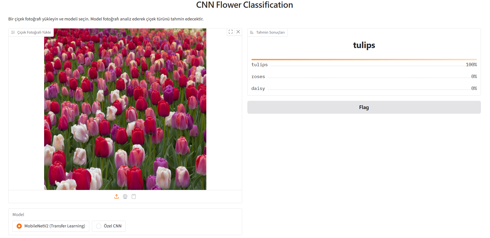
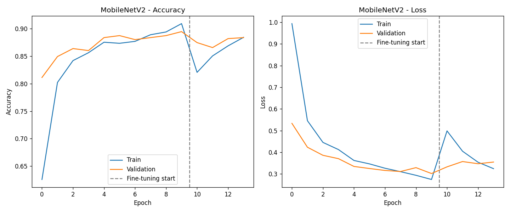
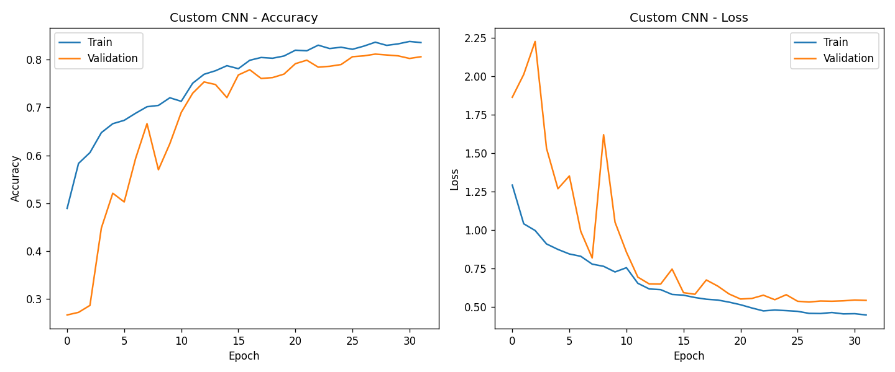
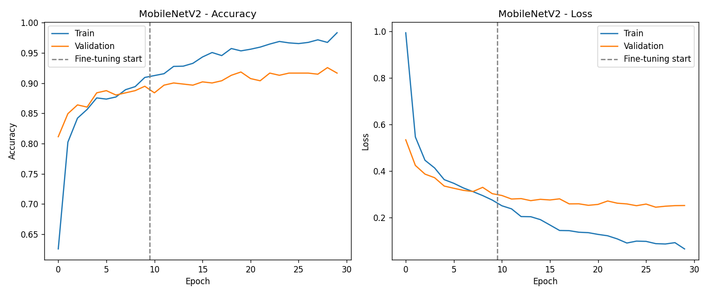
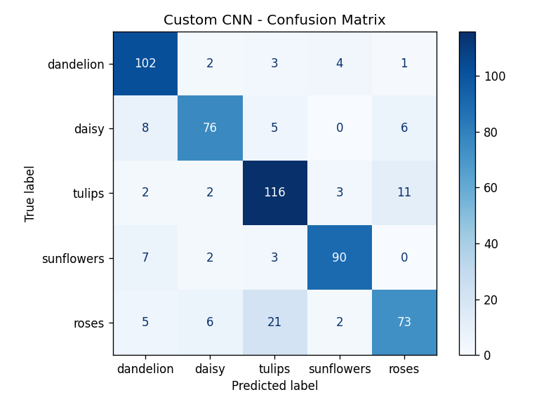
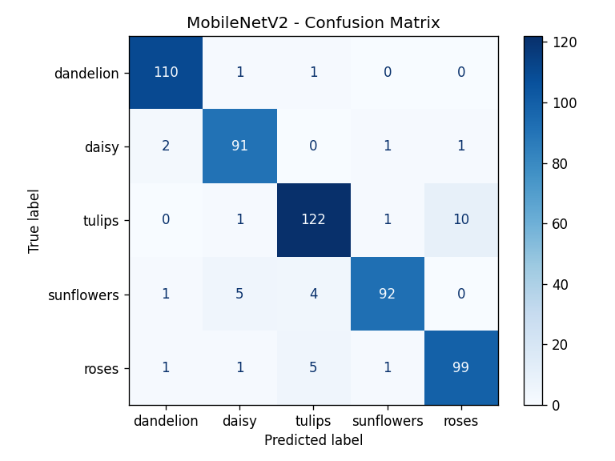
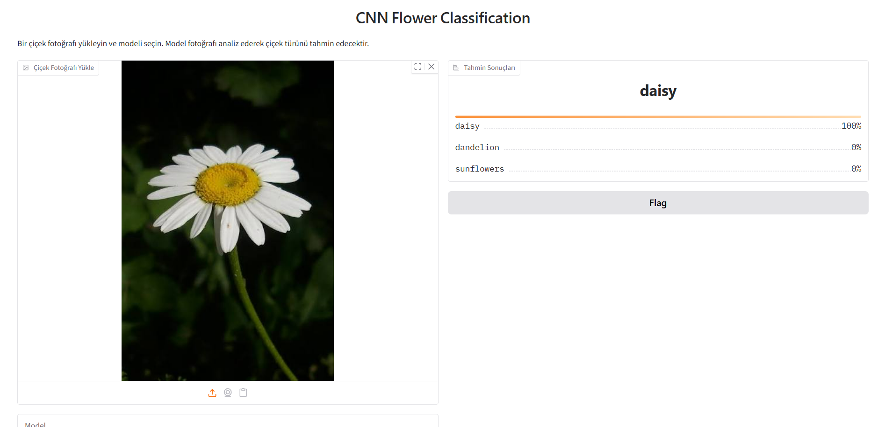
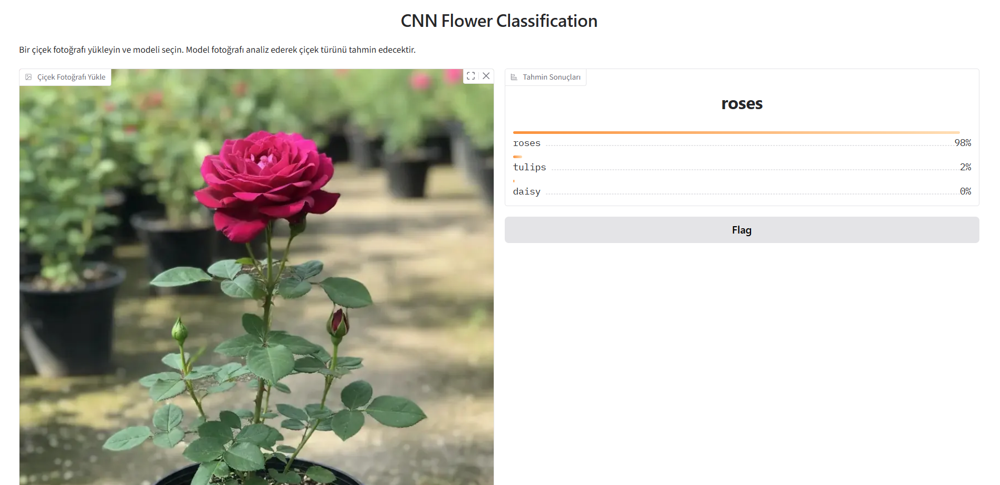

# Flower Species Classification: Custom CNN vs. Transfer Learning



This project classifies flower photos into five species (daisy, dandelion, rose, sunflower, tulip) using the [`tf_flowers`](https://www.tensorflow.org/datasets/catalog/tf_flowers) dataset and TensorFlow / Keras.

It started from a custom CNN at **73.45%** test accuracy. A diagnosis-driven redesign of that CNN raised it to **83.09%** with 16× fewer parameters, and a fine-tuned **MobileNetV2** reached **93.45%**. A Gradio app lets you upload a photo and compare the two final models.

## Results

| Model | Parameters | Val accuracy | Test accuracy | Test loss |
|---|---:|---:|---:|---:|
| Baseline CNN (3 conv blocks, Flatten) | 6.65M | 72.78% | 73.45% | 0.717 |
| CNN + Global Average Pooling | 110K | 68.06% | 70.55% | 0.753 |
| Deeper CNN (4 conv blocks, BatchNorm, GAP) | 423K | 80.76% | 83.09% | 0.482 |
| **MobileNetV2, fine-tuned** | 2.26M | **91.65%** | **93.45%** | **0.195** |

- **Data split:** all models use the same split of the 3,670 images: 70% train (2,569), 15% validation (551), 15% test (550).
- **Model selection:** checkpoints are selected on validation loss. The decision to keep the fine-tuned MobileNetV2 was also made on validation loss, before its test result was looked at. The test split is only used to report the numbers above.
- **Reproducibility:** both training scripts are seeded and use `enable_op_determinism()`. Re-running `transfer_learning.py` reproduced the stage-1 validation losses exactly.
- Raw metrics, including per-class precision/recall/F1 and confusion matrices, are in [`images/*_metrics.json`](images/).

## How the model improved

### 1. Baseline CNN: 73.45%

The first model is a plain CNN:

- three Conv2D + MaxPooling blocks (32, 64, 128 filters) on 180×180 inputs
- `Flatten`, `Dense(128)`, `Dropout(0.5)` and a softmax output
- training augmentation: random flip, brightness, contrast and crop

The model has 6.65M parameters, and **6.55M of them sit in the single Dense layer after `Flatten`**.

### 2. Global Average Pooling: 70.55%, worse

Replacing `Flatten` with `GlobalAveragePooling2D` cut the parameters from 6.65M to 110K, but accuracy dropped.

The training curves show this was **underfitting, not overfitting**: training accuracy stopped at about 72% and validation at about 69%. There were two reasons:

- **Small receptive field.** After three 3×3 convolutions and poolings, each feature sees only about a 22×22-pixel patch of the image. Global average pooling then averages these local features, so the model ends up judging mostly by local colour and texture. The baseline's large Dense layer could also use *where* each feature appeared in the image. GAP throws that information away.
- **Learning rate dropped too fast.** `ReduceLROnPlateau` with patience 2 cut the learning rate from 1e-3 to 8e-6 within six epochs, which froze training early.

### 3. Deeper CNN with BatchNorm: 83.09%

The fix targeted that diagnosis:

- **A fourth conv block (256 filters)** widens the receptive field to about 46×46 pixels.
- **Conv → BatchNorm → ReLU** in every block speeds up and stabilises training.
- **`ReduceLROnPlateau` patience raised to 3.**

Training and validation accuracy now track each other (83% / 81%), so the underfitting is gone. The result is **9.6 points above the baseline with 16× fewer parameters**. Dandelion → sunflower confusions, two yellow, radial flowers, dropped from 16 to 4.

### 4. Transfer learning with MobileNetV2: 89.64%

[`transfer_learning.py`](transfer_learning.py) uses MobileNetV2 with ImageNet weights on 224×224 inputs:

- **Inside the model:** pixel rescaling to [-1, 1] and data augmentation (flip, rotation, zoom, contrast). The model takes raw 0–255 images, so the app cannot apply the wrong preprocessing.
- **Head:** global average pooling, dropout 0.3 and a softmax layer.

Stage 1 trains only this head with the base frozen (Adam 1e-3, 10 epochs). This alone reaches a validation loss of 0.302 and **89.64%** test accuracy.

### 5. Fine-tuning and the BatchNorm problem: 93.45%

Stage 2 unfreezes the last 30 layers of MobileNetV2 and trains them with Adam at 1e-5.

**First attempt:** the BatchNorm layers inside the unfrozen block were trainable. As soon as fine-tuning started:

- training loss jumped from 0.27 to 0.50 and validation loss got worse
- early stopping (patience 3) ended fine-tuning after 4 epochs, so selection kept the stage-1 model



**Second attempt:** the 11 BatchNorm layers in the unfrozen block were kept frozen, so only the 10 convolutional layers were trained, and early-stopping patience was raised to 5.

- The jump disappeared. Validation loss fell from 0.302 to **0.244**.
- The rule set in advance was to keep the fine-tuned model only if its validation loss beat the stage-1 model's. It did, and its test accuracy turned out to be **93.45%**.
- Because training is deterministic, stage 1 was identical in both attempts. The comparison isolates the BatchNorm change and the patience change. These two changes were made together, so their individual effects are not separated.

## Training curves

**Deeper CNN.** The validation loss is noisy in the first epochs while the BatchNorm statistics settle, then follows the training loss closely.



**MobileNetV2.** The dashed line marks the start of fine-tuning. Validation loss levels off around 0.25 while training accuracy keeps rising, so longer training would mostly add overfitting.



## Confusion matrices

| Deeper CNN (83.09%) | MobileNetV2, fine-tuned (93.45%) |
|---|---|
|  |  |

## Roses vs. tulips: the hardest pair

Across all four models, the rose–tulip pair causes roughly a third or more of all errors:

| | Baseline | CNN + GAP | Deeper CNN | MobileNetV2 |
|---|---:|---:|---:|---:|
| Total test errors | 146 | 162 | 93 | 36 |
| Rose → tulip | 27 | 28 | 21 | 5 |
| Tulip → rose | 19 | 26 | 11 | 10 |
| **Share of all errors** | **32%** | **33%** | **34%** | **42%** |

Roses and tulips share the same colour range (red, pink, yellow, orange), and a half-open rose has the same cup shape as a tulip. Telling them apart requires fine detail: the layered, spiralled petals of a rose against the smooth petals of a tulip.

MobileNetV2 cut these errors from 46 to 15, but other errors fell even faster. **Rose vs. tulip is what remains once the easy mistakes are gone.**


This rose from the test split is a typical case:

- deeper CNN: *tulip* (0.60), with rose at 0.27
- MobileNetV2 before fine-tuning: *tulip* (0.60)
- fine-tuned MobileNetV2: correctly *rose* (0.82)

## Running the project

### Installation

```bash
git clone https://github.com/kubraaucar/CNN-Flower-Species-Classification.git
cd CNN-Flower-Species-Classification

python -m venv venv
venv\Scripts\activate          # Windows
# source venv/bin/activate     # macOS / Linux

pip install -r requirements.txt
```

### Gradio app

```bash
python app.py
```

Open the local URL printed in the terminal, upload a photo and choose a model. The default is MobileNetV2. "Özel CNN" ("custom CNN") is the deeper CNN.

| | |
|---|---|
|  |  |

### Training

```bash
python cnn.py                 # deeper custom CNN   -> best_model.keras
python transfer_learning.py   # MobileNetV2         -> mobilenetv2_model.keras
```

- **Dataset:** `tf_flowers` is downloaded automatically by TensorFlow Datasets on the first run.
- **Training time:** on an 8-core CPU, each script takes roughly 35–50 minutes.
- **Outputs:**
  - Training curves, confusion matrices and metrics are written to `images/`.
  - Retraining overwrites the model files.
  - The committed models were re-saved without optimizer state (5.2 MB → 1.8 MB and 21.8 MB → 9.7 MB, identical predictions).

## Project structure

```text
├── app.py                    Gradio interface with a model selector
├── inference.py              per-model preprocessing and prediction
├── cnn.py                    custom CNN: training and evaluation
├── transfer_learning.py      MobileNetV2: frozen-base training + fine-tuning
├── best_model.keras          deeper custom CNN (4 blocks, BatchNorm, GAP)
├── cnn_gap_model.keras       3-block GAP CNN from step 2, kept for comparison
├── mobilenetv2_model.keras   fine-tuned MobileNetV2 (default model in the app)
├── images/                   training curves, confusion matrices, metrics JSON, screenshots
├── space/                    ready-to-upload Hugging Face Spaces folder (not deployed)
├── PROGRESS.md               development log (in Turkish)
└── requirements.txt
```

The original baseline model (80 MB) is not in the working tree. It is available in the repository history as `best_model.keras` in commit `e53ebdf`.

## Future work

- **Rose vs. tulip:**
  - Look at the remaining misclassified images.
  - Try higher input resolution or unfreezing more layers so the model can use petal structure.
- **Grad-CAM:** check what each model looks at, and test whether the shallow CNNs really rely on colour.
- **Variance across runs:** the validation set has 551 images, so one image is about 0.18 points. Repeated runs with different seeds or cross-validation would show how much of each gap is noise.
- **Hyperparameter search:**
  - number of unfrozen layers and learning rate
  - separate the effect of frozen BatchNorm from the higher early-stopping patience
  - other backbones such as EfficientNet
- **Live demo:**
  - The `space/` folder is ready for Hugging Face Spaces, but Gradio Spaces on free hardware currently require a PRO subscription.
  - Alternatively, the model could run in the browser via TensorFlow.js or ONNX.
- **App language:** translate the Gradio interface, which is currently in Turkish.

## Tech stack

Python · TensorFlow / Keras · TensorFlow Datasets · NumPy · scikit-learn · Matplotlib · Gradio
